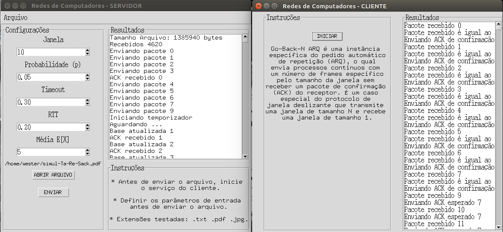

# Protocolo-go-back-n

## Trabalho realizado para a disciplina de redes de computadores

O trabalho proposto tem como objetivo implementar um protocolo
confiável tipo Go-Back-N para transferência de arquivos, utilizando
o protocolo da camada de transporte UDP para estabelecer uma
conexão entre processos. Para simular perdas de pacotes foi
requisitado uma função para simular atrasos na rede para o
recebimento de ack e  mensagens. Também deve-se implementar
uma função  que escolhe se o pacote será entregue ou não.
Isto é, um pacote é perdido com probabilidade p.

## Requisitos

* Python >= 3.5
* Tkinter

## Execução

* Executar o arquivo tkinterCliente.py e clicar no botão para iniciar o serviço.
* Executar o arquivo tkinterServidor.py e configurar os parâmetros necessários para enviar o arquivo selecionado.

OU

* Executar o arquivo tkinterCliente e tkinterServidor na pasta dist

